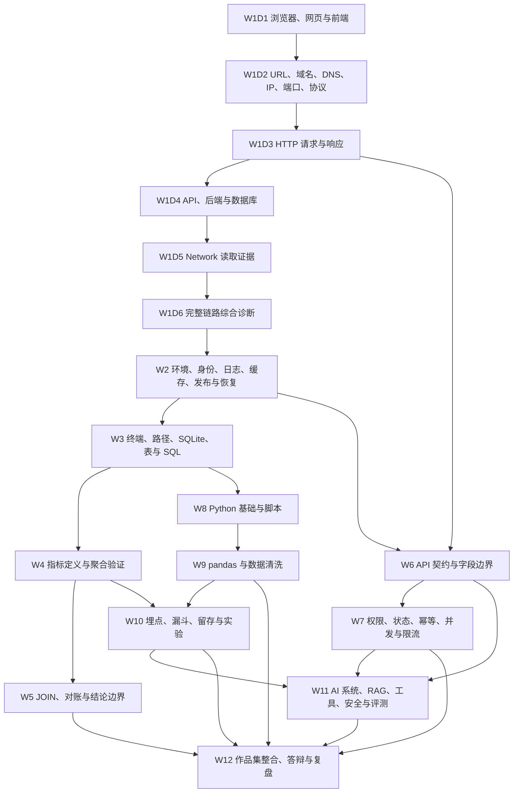

# 72 日课程盘点与依赖审计

> 审计日期：2026-08-13  
> 审计范围：`/Users/mac/Desktop/产品技术实验室` 当前源码、课程数据、页面路由、证据账本、实验资料与校验脚本。  
> 本文是当前状态盘点，不把旧周课提纲、共享题库或空白模板误称为已完成的每日教材。

## 一、结论摘要

1. `src/data.ts` 中确实登记了 12 周 × 6 天，共 72 条日级元数据；但除 W1D1 外，另外 71 条都仍是 `makeLessons()` 生成的旧版提纲，不是新的 `DailyCourse` 教材。
2. 当前真正拥有独立内容、独立页面和完整 12 段教学闭环的只有 W1D1。它包含 5 个目标、3 个前置检查、12 个完整概念、10 个关系图节点、11 步示范、8 步引导实验、独立变式、4 道专属练习、15 字段成果教学和 6 个复习阶段。
3. `hashRouter.ts` 可以解析形如 `#/lesson/W2D3` 的地址，但 `App.vue` 只为 `W1D1` 渲染日课组件。W1D2–W12D6 目前没有可用的独立日课页面；仅仅“地址格式可解析”不能算“每日课程能独立打开”。
4. W1、W2 现有的是周级特制旧页面；W3–W12 现有的是周级场景、观察器、6 步实验指南和 10 个 ZIP 资料包。它们是可复用素材，不是 60 个已经完成的日课。
5. 120 道即时选择题按周归属，没有 Day 归属；每题只有总解释，没有新版要求的逐项理由、错误选项在何种条件下成立、评分量规和补学锚点。它们不能直接充当每日 3–5 道针对性练习。
6. 其余 71 Day 的五层开放练习来自同一个字符串模板：只替换课名和成果名。它们正是本次重构需要移除的机械生成内容，不能换个数据结构继续复用。
7. `evidenceStore.ts` 的 v2 账本已经按 `DayId` 泛化，并具备尝试、错题、复测、成果、迁移、D1/D3/D7/D14/D30/D60 和完成/掌握分离的数据基础；但生产 UI 目前只把它接到 W1D1。
8. 当前已建立 72 Day 权威注册表、概念首次教学唯一性约束、跨日前置校验和课程目录验证；真实注册仍为 1/72。`validateDailyCourse()` 已改为通用完整性底线，不再强迫每 Day 复制 W1D1 的 12 概念、4 组主干和 11 步示范体量；`validate:w1d1` 继续单独承担基准专用 23 项检查。实验资产的日级专属适配仍需随其余 71 Day 完成。

## 二、审计口径与数据来源

### 2.1 深度等级

| 等级 | 含义 | 当前数量 |
|---|---|---:|
| Q4 基准日课 | 独立 `DailyCourse` 数据、独立页面、完整首次教学、示范、双实验、专属练习纠错、成果教学、复习与证据接入 | 1 |
| Q1 周素材支持的日提纲 | 有当天标题、说明和成果名，并可借用周级案例/观察器/实验包；但没有当天完整正文与独立页面 | 71 |
| Q0 空登记 | 只有 ID 或占位文案 | 0 |

Q1 不表示“接近完成”。它只表示旧系统至少保留了课程意图和一些可改造素材。

### 2.2 来源代码

| 代号 | 当前来源 | 实际粒度 |
|---|---|---|
| `D` | `src/course/w1d1.ts` + `DailyLessonView.vue` + `W1D1Page.vue` | 日级完整教材，仅 W1D1 |
| `M` | `src/data.ts` 的 `weeks` / `makeLessons()` | 72 条日级提纲；其中 71 条仍是旧结构 |
| `F` | `src/deepCurriculum.ts` | 每周 3 个问题、4 层主题、进阶任务和术语 |
| `O` | `src/lessonFramework.ts` | 每周 1 个案例、1 个观察器、5 条记忆与下周衔接 |
| `G` | `src/weekGuides.ts` | W3–W12 每周 1 个实验指南、2 个常见错误和 1 份周成果清单 |
| `Q` | `data.ts`、`extendedQuiz.ts`、`advancedQuiz.ts` | 每周 10 道选择题，共 120 道；无 Day 映射 |
| `A` | `public/labs/` | W3–W12 共 10 个周级 ZIP 资料包，当前压缩包完整性均通过 |

### 2.3 非 W1D1 的实际日数据深度

每个旧 Day 当前只有：

- 1 个当天标题；
- 1 句当天说明；
- 1 个成果名称；
- 1 个按课型套用的闭卷问题；
- 1 个按课型复用的通过量规；
- 5 道统一句式开放练习。

它们没有独立的工作场景、可验证目标、前置检查、概念正文、日级关系图、完整示范、引导实验、独立变式、逐题纠错、成果写作教学和日级复习任务。

## 三、72 Day 逐日盘点

表中“周共享素材”只表示可供改造，不表示该 Day 已经完成。

### W1：浏览器、地址、HTTP 与完整请求链路

| Day | 当前主题 / 当日产出 | 当前来源与深度 | 当前专属素材 | 独立页 | 依赖与重排结论 |
|---|---|---|---|---|---|
| W1D1 | 浏览器、网页与前端；职责边界表 | `D`，Q4 基准 | 12 概念、关系图、11 步示范、DOM/Console 沙盒、4 题、完整成果教学 | 有 | 已按新顺序完成；是后续质量门槛，不是可复制文案模板 |
| W1D2 | 旧：HTTP 请求证据结构 / Network 标注图；新目标：URL、域名、DNS 与服务器地址 | `M`，Q1 | 只有 W1 旧周页共享的请求链/Network | 无 | 当前主题与批准的新 W1D2 不一致；必须重写，不能先教 Header/Payload |
| W1D3 | 旧：追踪订单预览请求 / 请求观察记录；新目标：HTTP 请求与响应 | `M`，Q1 | W1 旧周级请求动画和模拟 Network | 无 | 旧版在完整讲 HTTP 前直接实验，顺序倒置；先完成 Method、URL、Header、Cookie、Query、Payload、Status、Response、Timing、Size 首次教学 |
| W1D4 | 旧：四类页面转圈 / 故障定位表；新目标：API、后端与数据库 | `M`，Q1 | W1 旧诊断文案 | 无 | API、后端、数据库尚未首次完整教学，不能先做综合诊断 |
| W1D5 | 旧：把加载与异常写进需求 / 边界清单；新目标：使用 Network 读取证据 | `M`，Q1 | W1 模拟 Network 可迁移到此日 | 无 | 这是旧 Network 资产的首个合理落点；须先逐列教学，再进入判读 |
| W1D6 | 绘制工作功能链路 / 功能技术链路图；新目标：完整链路与综合诊断 | `M`，Q1 | W1 请求链、模拟 Network、链路填写器可部分复用 | 无 | 可承接无请求、Pending、4xx、5xx、200 页面失败、写入未持久化六类综合变式 |

### W2：环境、身份、日志、缓存、发布与恢复

| Day | 当前主题 / 当日产出 | 当前来源与深度 | 当前专属素材 | 独立页 | 依赖与风险 |
|---|---|---|---|---|---|
| W2D1 | 环境、配置与版本差异 / 环境差异矩阵 | `M+F+O`，Q1 | W2 周案例；无日级文件 | 无 | 顺序基本合理；需依赖 W1 完整链路，并补代码、配置、数据、依赖版本的区别 |
| W2D2 | 状态码与错误链路 / 状态码处置图 | `M+F+O`，Q1 | W2 四故障模拟共享 | 无 | 一天捆绑 401/403/404/409/429/500/502/504 过密；认证、授权和恢复动作须先教后判读 |
| W2D3 | 故障注入与日志关联 / 故障证据卡 | `M+F+O`，Q1 | `faultScenarios` 与模拟日志 | 无 | 日志、时间窗口、request_id、日志层级应在实验前完成首次教学 |
| W2D4 | 缓存、并发与数据一致性 / 一致性诊断表 | `M+F+O`，Q1 | 缓存故障场景共享 | 无 | “并发”会抢跑 W7；本日应收敛为缓存层级、失效和一致性，复杂并发留到 W7 |
| W2D5 | 发布、灰度、监控与回滚 / 发布验收清单 | `M+F+O`，Q1 | 周级案例/记忆，无运行包 | 无 | 需以前四日的环境、日志、缓存证据为前置；必须教阈值、观察窗、责任人和数据兼容 |
| W2D6 | 研发可用 Bug / 标准 Bug 报告 | `M+F+O`，Q1 | 旧页 Bug 表单 | 无 | 表单可复用交互，不可替代“字段教学—差稿—修订—范例—引导版—空白版—自检” |

### W3：终端、SQLite、数据表与 SQL 基础

| Day | 当前主题 / 当日产出 | 当前来源与深度 | 当前专属素材 | 独立页 | 依赖与风险 |
|---|---|---|---|---|---|
| W3D1 | 从业务问题到数据问题 / 问题拆解模板 | `M+F+O+G+A3`，Q1 | W3 周包 `setup.sql` 等共享 | 无 | 当前一次带入表、行、列、主键、类型、字典，但没有先教终端、路径、SQLite；应先补运行环境与文件安全 |
| W3D2 | SELECT 执行逻辑 / SQL 执行顺序图 | 同上 | 周包共享 | 无 | 依赖能打开终端、进入正确目录、创建 SQLite 数据库，并理解表/行/列/类型/NULL |
| W3D3 | 用户与订单基础查询 / 6 道基础查询 | 同上 | `setup.sql`、`exercises.sql`、`answers.sql`、`self_check.sql` | 无 | 资料可直接改造为引导实验，但必须拆成预测—操作—观察—记录—解释—对照；答案不能提前暴露 |
| W3D4 | 查询为何不可信 / 数据质量检查表 | 同上 | 周数据中的 NULL、重复、状态和时区样本 | 无 | 应在 NULL、时间边界、测试数据和重复版本完成教学后诊断 |
| W3D5 | 向数据研发确认口径 / 取数需求单 | 同上 | 当前只有周级清单，无完整文档教学 | 无 | 取数需求属于要求重写的工作文档，不能只给字段名 |
| W3D6 | 回答真实业务问题 / 12 道业务查询集 | 同上 | W3 完整周包最适合此日综合迁移 | 无 | 需串联 D1–D5，并明确每条结果能/不能支持什么 |

### W4：先定义指标，再用 SQL 验证

| Day | 当前主题 / 当日产出 | 当前来源与深度 | 当前专属素材 | 独立页 | 依赖与风险 |
|---|---|---|---|---|---|
| W4D1 | 指标不是一个数字 / 指标树 | `M+F+O+G+A4`，Q1 | W4 周包与口径空表共享 | 无 | 顺序正确；必须先讲决策、信号、分子、分母、去重、时间和排除，再碰聚合 SQL |
| W4D2 | 聚合与分组 / 聚合逻辑图 | 同上 | `setup.sql`、`exercises.sql`、`answers.sql` | 无 | 硬依赖 W3 SELECT/WHERE/NULL/粒度；需逐步教 COUNT、DISTINCT、SUM、AVG、GROUP BY、HAVING |
| W4D3 | 活跃、转化与客单价 / 指标计算 SQL | 同上 | W4 同一事件数据集 | 无 | 可改造为引导+独立变式，但三个指标不能只作为机械换公式练习 |
| W4D4 | 三种上涨假象 / 误导案例分析 | 同上 | 周观察器可显示分母/异常值变化 | 无 | 需先教样本量、分布、幸存者偏差和异常大单；模拟器只是观察证据之一 |
| W4D5 | 指标口径评审 / 指标口径表 | 同上 | `metric-definition.md` 目前主要是空白模板 | 无 | 缺差稿、字段来源、修订过程、完整范例、引导版和可执行自检 |
| W4D6 | 给产品搭指标树 / 产品指标树 | 同上 | 周级概念链与模板 | 无 | 必须迁移到新业务场景，并区分北极星、过程与护栏；不能只画名词树 |

### W5：JOIN、对账与结论边界

| Day | 当前主题 / 当日产出 | 当前来源与深度 | 当前专属素材 | 独立页 | 依赖与风险 |
|---|---|---|---|---|---|
| W5D1 | 连接键与数据粒度 / 表关系图 | `M+F+O+G+A5`，Q1 | W5 三表数据共享 | 无 | 硬依赖 W3 表/键/NULL，软依赖 W4 指标粒度；先教“一行代表什么” |
| W5D2 | 四种 JOIN 保留规则 / JOIN 对照图 | 同上 | 周包共享 | 无 | 应用小样本逐行推演，不能用集合图代替业务粒度教学 |
| W5D3 | 连接用户、行为与订单 / 多表 SQL | 同上 | `setup.sql`、`exercises.sql`、`answers.sql` | 无 | 可作为引导实验；须记录每步行数、唯一键与金额，而非只看最终结果 |
| W5D4 | 重复放大与数据缺口 / 质量诊断单 | 同上 | 故意制造一对多放大的周数据 | 无 | 资产匹配度高；需要独立变式而非重复运行答案 SQL |
| W5D5 | 分析结论的证据强度 / 结论分级表 | 同上 | 周级错误案例 | 无 | 必须区分事实、相关、推测、因果；不能由 JOIN 差异直接宣称功能效果 |
| W5D6 | 小型数据分析 / 数据分析报告 | 同上 | `reconciliation.md` 只有对账骨架 | 无 | 数据分析报告是重点工作文档，需完整写作教学和合格范例 |

### W6：API 契约与字段边界

| Day | 当前主题 / 当日产出 | 当前来源与深度 | 当前专属素材 | 独立页 | 依赖与风险 |
|---|---|---|---|---|---|
| W6D1 | HTTP 与资源建模 / 接口心智图 | `M+F+O+G+A6`，Q1 | API 契约周包共享 | 无 | 不应重复 W1D3 的 HTTP 首次教学；应只做复习后转向资源、动作和契约责任 |
| W6D2 | 请求与响应解剖 / 报文标注图 | 同上 | `requests.http`、契约示例 | 无 | 同样要避免重教 HTTP；重点放在字段位置选择与契约语义 |
| W6D3 | 构造 GET/POST/PATCH / 请求集合 | 同上 | `requests.http`、3 个 payload、Python 校验器 | 无 | 可作为引导实验；无需真实服务器，但必须说明纸面验证能/不能证明什么 |
| W6D4 | 接口成功但功能失败 / 接口诊断表 | 同上 | payload 边界和校验器 | 无 | 依赖字段类型、序列化、HTTP/业务错误与超时边界已教学 |
| W6D5 | 字段契约与版本兼容 / 字段契约 | 同上 | `api-contract.md` 有一份较完整示例 | 无 | 可用作教师范例，但仍缺差稿到合格版本的逐步修订与引导/空白双模板 |
| W6D6 | 评审接口文档 / 接口评审意见 | 同上 | 周包整体 | 无 | 适合新接口变式迁移；必须检查旧客户端、未知枚举、null/空/缺失和超时/幂等 |

### W7：权限、状态、幂等、并发、分页与限流

| Day | 当前主题 / 当日产出 | 当前来源与深度 | 当前专属素材 | 独立页 | 依赖与风险 |
|---|---|---|---|---|---|
| W7D1 | 权限模型与状态机 / 权限矩阵 | `M+F+O+G+A7`，Q1 | 20 项验收矩阵共享 | 无 | 依赖 W2 身份/权限和 W6 API；RBAC、资源、动作、状态迁移一天仍偏密 |
| W7D2 | 分页、幂等与并发 / 异常机制图 | 同上 | 模拟器和验收矩阵 | 无 | 三个机制不可只在同一张图里带过；至少分别建立输入、状态、证据与失败边界 |
| W7D3 | 破坏式接口验收 / 验收证据集 | 同上 | `acceptance-matrix.xlsx/csv`、`simulate_api.py` | 无 | 资产很强，但须在 D1/D2 完整教学之后运行；矩阵执行不是首次教学 |
| W7D4 | 409、429 与重试风暴 / 异常诊断表 | 同上 | 模拟器可验证冲突、限流和重试 | 无 | 需明确 409 不只一种业务含义，429 恢复依赖 Retry-After、退避和上限 |
| W7D5 | 异常状态与恢复路径 / 异常体验清单 | 同上 | 周级案例 | 无 | 需覆盖保留输入、提示、重试、查询结果、人工兜底，而非只写状态码 |
| W7D6 | 完成接口验收矩阵 / 接口验收矩阵 | 同上 | 20 项矩阵可作为成果起点 | 无 | 验收矩阵工作文档仍需字段教学、差稿、修订、范例和独立空白版 |

### W8：Python 基础与可重复脚本

| Day | 当前主题 / 当日产出 | 当前来源与深度 | 当前专属素材 | 独立页 | 依赖与风险 |
|---|---|---|---|---|---|
| W8D1 | 程序如何表达步骤 / 代码结构标注 | `M+F+O+G+A8`，Q1 | 标准库脚本周包共享 | 无 | 当前一天塞入变量、类型、条件、循环、函数、模块，明显过密；需拆教学层次或启用进阶扩展周 |
| W8D2 | 从输入到输出 / 执行流程图 | 同上 | `starter.py`、JSON 样本 | 无 | 依赖变量、类型、列表/字典、函数已首次教学；不能靠读完整脚本反推基础概念 |
| W8D3 | 处理 JSON 和 CSV / 数据处理脚本 | 同上 | 正常/异常 JSON、起始与答案脚本 | 无 | JSON、CSV、文件路径和编码都需先教；当前包实际重点为 JSON，CSV 教学证据较弱 |
| W8D4 | Traceback 与报错 / 错误排查表 | 同上 | `orders_invalid.json` 可触发错误 | 无 | 需先教异常类型、调用栈、文件路径和键缺失；要有多个可恢复变式 |
| W8D5 | 自动化边界与安全 / 脚本验收清单 | 同上 | README 与预期输出 | 无 | 必须覆盖输入契约、敏感数据、幂等输出、日志、不可逆操作和何时不自动化 |
| W8D6 | 每日业务摘要 / 自动摘要脚本 | 同上 | 完整周包最适合作综合成果 | 无 | 脚本说明属于重点工作文档；需教 README、运行、输入/输出、错误与限制如何写 |

### W9：pandas 与可审计清洗

| Day | 当前主题 / 当日产出 | 当前来源与深度 | 当前专属素材 | 独立页 | 依赖与风险 |
|---|---|---|---|---|---|
| W9D1 | DataFrame 与可复现处理 / pandas 操作图 | `M+F+O+G+A9`，Q1 | 脏订单 CSV 与脚本共享 | 无 | 硬依赖 W8 文件、类型、函数、异常；还需处理 pandas 安装与离线可用性 |
| W9D2 | 数据质量六维 / 质量检查框架 | 同上 | `quality-rules.md` | 无 | 应先教质量维度与业务含义，再运行删除/填充规则 |
| W9D3 | 清洗订单 / 清洗脚本 | 同上 | `orders_dirty.csv`、starter/answer | 无 | 可改造为引导实验；答案脚本不能替代逐步观察和独立变式 |
| W9D4 | 清洗规则是否伤害数据 / 规则影响分析 | 同上 | 故意设计的空、重复、负数、未知状态样本 | 无 | 需比较标记、修复、隔离、保留，不可把“删掉异常”当默认答案 |
| W9D5 | 数据输入输出契约 / 数据契约 | 同上 | 当前规则文档较短 | 无 | 数据契约工作文档缺完整写作教学、来源说明、差稿和范例 |
| W9D6 | 自动质量报告 / 自动分析文件 | 同上 | 可产出 clean/quarantine/report | 无 | 要证明原始=清洁+隔离、规则版本可追溯、重复运行一致 |

### W10：埋点、漏斗、留存与 A/B 实验

| Day | 当前主题 / 当日产出 | 当前来源与深度 | 当前专属素材 | 独立页 | 依赖与风险 |
|---|---|---|---|---|---|
| W10D1 | 用户行为到事件数据 / 事件模型 | `M+F+O+G+A10`，Q1 | SQLite 实验周包共享 | 无 | 需依赖 W4 口径；事件、属性、用户、会话、触发、去重需完整首次教学 |
| W10D2 | 漏斗、留存与分群 / 分析框架图 | 同上 | 周级数据与观察器 | 无 | 一天同时首次教漏斗、留存、cohort、窗口、顺序和去重过密，建议拆日或转入扩展周 |
| W10D3 | 模拟埋点与样本变化 / 模拟实验记录 | 同上 | `setup.sql`、`analysis.sql`，故意含 45:55 和覆盖缺口 | 无 | 当前在 A/B 随机化、分流和护栏完整教学前进入实验，存在概念抢跑 |
| W10D4 | 实验结果为何不可信 / 实验风险表 | 同上 | SRM、污染、分母覆盖样本 | 无 | 应先教实验单位、入组、曝光、基线、SRM、提前停止与多重检验，再诊断 |
| W10D5 | 埋点与实验设计评审 / 评审清单 | 同上 | `decision-record.md` 为空白骨架 | 无 | 缺埋点方案和实验设计文档的字段教学、差稿修订、完整范例与自检 |
| W10D6 | 设计产品实验 / 指标与埋点方案 | 同上 | 周包整体 | 无 | 需从假设、机制、事件、指标、样本、周期、停止规则到决策阈值形成完整迁移 |

### W11：AI 系统、RAG、工具、安全与评测

| Day | 当前主题 / 当日产出 | 当前来源与深度 | 当前专属素材 | 独立页 | 依赖与风险 |
|---|---|---|---|---|---|
| W11D1 | AI 功能不是一个 Prompt / AI 系统链路 | `M+F+O+G+A11`，Q1 | 20 条评测集周包共享 | 无 | 方向正确，但一天列模型、上下文、RAG、工具、规则、审计，只能做总览；后续必须分别首次教学 |
| W11D2 | 工具调用 / AI 调用图 | 同上 | 评测样本中含工具、权限、确认与结果场景 | 专属 Day 01 renderer／bridge | 只首教动作边界、工具合同、提案、参数、权限、确认、执行、副作用与回执；RAG 首教排期不由本日承载 |
| W11D3 | 构建最小评测集 / 20 条评测样本 | 同上 | `eval_cases.jsonl`、评分表、校验器 | 无 | 资产质量高，但评测维度、样本分层和通过门槛必须在实验前教学；不能只是复制现成 20 条 |
| W11D4 | 幻觉从哪里产生 / 失败分类表 | 同上 | 固定失败类别与对抗样本 | 无 | 需分开知识缺失、召回、资料冲突、生成、工具和表达证据 |
| W11D5 | 成本、延迟与安全 / AI 风险清单 | 同上 | 量表含安全门槛，样本含成本/延迟/注入 | 无 | Prompt injection、隐私、越权、高风险动作、降级与人工兜底不能只作为清单 |
| W11D6 | 评测 AI 客服 / AI 评测报告 | 同上 | 完整周包可作综合迁移 | 无 | AI 评测集/报告是重点文档，需完整写作教学和新的独立样本变式 |

### W12：端到端作品集整合、答辩与复盘

| Day | 当前主题 / 当日产出 | 当前来源与深度 | 当前专属素材 | 独立页 | 依赖与风险 |
|---|---|---|---|---|---|
| W12D1 | 定义值得解决的问题 / 项目 Brief | `M+F+O+G+A12`，Q1 | `project-brief.md` | 无 | 应调用前 11 周真实成果，不应在最后一周首次教所有文档；当前模板仍缺完整范例与修订过程 |
| W12D2 | 系统与数据方案 / 方案蓝图 | 同上 | `system-and-data.md` | 无 | 硬依赖 W1/W6/W7/W10/W11；需从已有作品集组件组装，而非重新空填 |
| W12D3 | 可运行验证 / 验证证据 | 同上 | `validation-log.csv` 与前周实验包 | 无 | 必须选择最大未知，不能把任意一次运行截图都算验证 |
| W12D4 | 风险与失败预案 / 风险登记册 | 同上 | `risk-register.csv` | 无 | 风险登记册是重点文档，需概率、影响、预防、监控、触发、兜底、责任人完整教学 |
| W12D5 | 模拟跨职能评审 / 评审纪要 | 同上 | 无日级问答库 | 无 | 需要角色化追问、回答量规和证据不足反馈；当前只有一句提纲 |
| W12D6 | 作品集叙事与复盘 / 完整作品集 | 同上 | `portfolio-checklist.md` | 无 | 应整合已积累成果并完成 10 分钟答辩；当前系统没有跨周成果索引或作品集装配入口 |

## 四、依赖图与顺序风险

### 4.1 推荐主依赖图

### 4.2 当前最重要的顺序风险

1. **W1 旧顺序与已批准的新顺序冲突。** 旧 W1D2 直接讲 HTTP 字段，W1D3 直接追请求，W1D4 直接综合诊断；新顺序要求先地址与寻址，再 HTTP，再 API/后端/数据库，之后才进入 Network 和综合诊断。
2. **W2D4 抢跑并发。** 缓存与一致性可在 W2 教，但并发修改、版本冲突和幂等属于 W7 的契约与异常验收内容。
3. **SQL 运行前置缺失。** W3D1 直接进入数据概念，但零基础学习者还没有终端、路径、当前目录、SQLite 文件、脚本执行和只读/副本安全知识。
4. **W4 必须坚持“先口径、后聚合”。** 现有总体顺序可保留，但日课正文不能让 `COUNT`、`GROUP BY` 抢在分子、分母、去重、时间和排除规则之前。
5. **W6 重复 HTTP。** HTTP 首次教学应在 W1D3 完成；W6 要聚焦 API 契约、字段语义、错误、超时和兼容，不应重新从 Method/Status 开始占满一周。
6. **W8 一周负荷过高。** 变量、类型、集合、条件、循环、函数、异常、文件、JSON、CSV 同周首次教学难以达到 W1D1 深度。若真人计时无法通过，应启用 4–6 周进阶扩展，而不是压缩正文。
7. **W10 将漏斗、留存、cohort 和 A/B 压得过紧。** 当前 D3 在完整教授随机化、入组、曝光、SRM 和护栏前就进入实验模拟，存在实验先于概念的问题。
8. **W11D3 评测实验前置仍需在该日锁定。** 固定 20 条样本很好，但学习者必须先理解 AI 系统链、工具调用、权限和评分维度，才能独立构建而不是复制评测集；若样本涉及 RAG，必须先有另行批准的 RAG 首教证据，不能倒推 W11D2 已经教授。
9. **W12 缺跨周成果链。** 当前每周成果保存在不同旧状态或下载文件中，没有统一成果注册与版本索引，W12 无法可靠地“从前面持续积累”完成整合。
10. **概念 ID 尚未统一。** 旧词典只有 21 个周级概念；W1D1 新增 12 个日级概念，且存在 `frontend` 与 `front-end-code` 等命名分叉。没有中央概念注册表就无法可靠检查首次出现、前置、错题和掌握证据。

## 五、现有实验与素材资产映射

### 5.1 可复用资产

| 资产 | 当前内容 | 推荐落点 | 可复用程度 | 复用前必须补齐 |
|---|---|---|---|---|
| W1D1 `DailyCourse` 与通用日课视图 | 完整 12 段和证据交互 | 全部 Day 的结构基准 | 结构高、内容不可复制 | 把 W1D1 专属沙盒从通用视图中抽成实验适配器；按日配置门槛 |
| W1 旧请求链与模拟 Network | 六节点请求动画、Pending/200、链路填写器 | W1D5、W1D6 | 中 | 先完成 W1D2–D4 首次教学；新增预测、记录、解释、独立变式和证据边界 |
| W2 故障模拟与 Bug 表单 | 401/403/500/缓存场景、日志、表单 | W2D2–D6 | 中 | 拆分状态码前置；Bug 报告增加完整写作教学和量规 |
| W3 SQL 包 | setup、12 任务、答案、自检 | W3D1–D6，重点 D3/D6 | 高 | 增加终端/路径/SQLite 入门；答案延迟展示；逐步证据记录 |
| W4 指标包 | 同一漏斗三种口径、SQL、口径表 | W4D2–D6 | 高 | 先教指标契约；补口径表差稿、修订和完整范例 |
| W5 JOIN 包 | 三表、一对多放大、答案、对账表 | W5D1–D6 | 高 | 按日拆小实验；补独立变式和报告写作教学 |
| W6 API 契约包 | 契约示例、HTTP 请求、payload、校验器 | W6D3–D6 | 高 | 与 W1 HTTP 去重；明确本地校验器不能证明真实服务行为 |
| W7 异常验收包 | 20 项矩阵、Excel、模拟器 | W7D1–D6，重点 D3/D6 | 高 | 先教权限/状态/幂等/并发/分页/限流；增加成果范例与审核 |
| W8 Python 包 | 正常/异常 JSON、starter、answer、预期输出 | W8D2–D6 | 中高 | 补足基础语法分层、CSV、路径与运行环境；避免答案脚本成为抄写模板 |
| W9 pandas 包 | 脏 CSV、清洗脚本、规则 | W9D1–D6 | 高 | 处理依赖安装与离线环境；补规则版本变式和数据契约教学 |
| W10 实验包 | 埋点缺失、45:55 分流、决策记录 | W10D3–D6 | 高 | 把事件/漏斗/留存/A-B 前置拆清；补统计不确定性教学 |
| W11 AI 评测包 | 20 条固定样本、量表、评分表、校验器 | W11D3–D6 | 高 | 学习者必须新增独立样本；补系统链和失败层级首次教学 |
| W12 作品集包 | Brief、系统数据、验证日志、风险表、清单 | W12D1–D6 | 中高 | 从前周成果自动/手动关联；每种文档补完整范例和修订教学 |
| W3–W12 页面观察器 | 每周一组参数和动态结论 | 对应日的概念观察或示范 | 中 | 观察器不能替代引导实验；必须明确数据是教学模拟、证据能/不能证明什么 |
| 120 道周级选择题 | 每周 10 题，概念/判断/应用/评审 | 可作为选题素材库 | 低到中 | 重写 Day 归属、逐项解释、条件性成立、评分、错因和补学锚点 |

所有 10 个 `public/labs/*.zip` 已通过 `unzip -t` 完整性检查。该检查只证明压缩包可读取，不证明每个命令、答案、跨平台环境和教学流程均已验收。

### 5.2 当前素材不能证明的事情

- ZIP 存在不能证明对应 Day 已有完整教材。
- `answers.sql` / `answer.py` 能运行不能证明学习者经历了预测、观察、解释和独立变式。
- 观察器数值会变化不能证明学习者会操作真实工具或能迁移到新场景。
- 空白模板存在不能证明已经教会用户如何写文档。
- 120 道题存在不能证明每个 Day 有 3–5 道针对性练习。
- 路由正则接受 `WnDn` 不能证明页面能渲染、保存和完成。

## 六、禁止机械复用的边界

以下内容不得通过批量替换标题、术语或成果名扩展为 71 个 Day：

1. **不得继续调用 `makeLessons()` 生成五层练习。** 五道题的句式和推理要求完全共享，只替换课名和成果名，正是“统一句式机械生成”的问题来源。
2. **不得把周级四层框架复制六遍。** `deepCurriculum` 是周地图，不是每个新概念的首次教学；复制到每个 Day 会制造重复和虚假深度。
3. **不得把同一个周案例当作六个 Day 的完整示范。** 每个 Day 的示范必须围绕当天目标，从业务问题走完整证据链，并说明结论限制。
4. **不得把周级 6 步实验同时算作六个 Day 的引导实验。** 一个周包可以被拆成多日递进资产，但每个 Day 仍需自己的预测、操作、观察、记录、解释、对照和独立变式。
5. **不得把 10 道周题平均分到六天。** 题目必须依据当天已首次教学的概念重新设计；旧题没有逐项纠错和稳定补学锚点。
6. **不得把答案文件粘贴为教师示范。** 教师示范要展示为何做、看到什么、能证明什么、不能证明什么；最终答案只是一项材料。
7. **不得把空白字段清单当成果教学。** Bug 报告、取数需求、指标口径、接口契约、验收矩阵、埋点方案、分析报告、脚本说明、AI 评测集、风险登记册和作品集都必须具备 12 项完整写作教学。
8. **不得把 W1D1 的 12 个概念、11 步示范数量硬编码为所有日课最低数量。** 应复用完整字段和质量原则，不复制特定内容数量；不同 Day 根据概念负荷设验证配置。
9. **不得把 W1D1 文案改名后复用。** 浏览器/DOM 沙盒、前端边界案例和职责表只适用于 W1D1；SQL、API、Python、AI 等课程必须使用领域真实机制与证据。
10. **不得用自评、阅读、展开卡片或完成步骤替代能力证据。** 现有 v1 `practiceResults` 和周级自评只能保留为历史记录，不能迁入 v2 掌握等级。
11. **不得为满足“72 个页面”先生成 71 个空页面。** 空壳路由会让数量验收失真，应在日课内容达到最低门槛时才标记为可学习。
12. **不得在概念首次教学前复用旧实验。** 尤其禁止在 W1D2 提前出现 Network/API 诊断，在 W10 完整讲随机化前运行 A/B 决策，在 W11 完整讲检索/工具/权限前让学习者构建评测。

## 七、结构确认前可安全完成的全项目基础设施

这些工作不会预设具体日课文案，也不会替用户代替三项结构确认，可以先行实施：

### 7.1 72 Day 内容注册表

建议新增只保存课程事实与建设状态的 `courseCatalog`，每条至少包含：

- `id`、week、day、title、primaryGoal；
- 计划成果类型与资产引用；
- 前置 Day、前置概念；
- 当日首次教学概念；
- 内容状态：`outline / drafting / review / publishable`；
- 独立路由是否可发布；
- 内容版本、审阅人和最后校验时间。

注册表必须与真正的 `DailyCourse` 内容文件分开，防止把元数据存在误报为课程完成。

### 7.2 概念注册表与依赖图

建议统一旧词典与新概念 ID，记录：

- 概念唯一 ID、中文/英文名、完整定义；
- 首次教学 Day；
- 硬前置与软前置；
- 易混概念；
- 正确/错误示例、实验和成果引用；
- 练习和错题补学锚点；
- v2 证据与下次复习时间。

首次教学 Day 只能有一个；其他 Day 应标记“复用/加深/迁移”，避免重复宣称首次教学。

### 7.3 实验资产注册表

为每个 ZIP 和页面内实验记录：

- 资产路径、适用 Day、运行环境与依赖；
- 输入、预期输出、答案、自检与安全说明；
- 可验证概念和不能证明的边界；
- 是否支持引导实验、独立变式、系统判定或需要人工审核；
- 文件存在、ZIP 完整性、命令运行和跨平台状态。

### 7.4 分层课程校验器

将当前验证拆为：

1. **Catalog 校验：**恰好 72 个唯一 ID；W1D1–W12D6 无缺失；week/day 合法。
2. **依赖校验：**无环；前置只指向更早课程；首次使用不早于首次教学。
3. **日课结构校验：**12 个固定段落、4–6 个可验证目标、3–5 道练习、6 个复习阶段、全部补学锚点可解析。
4. **质量配置校验：**W1D1 基准门槛与普通 Day 门槛分离，不能全局硬编码“至少 9 个概念”。
5. **素材校验：**引用文件存在、ZIP 可读、命令与预期输出可验证。
6. **路由校验：**只有 `publishable` Day 可进入；每个已发布 Day 的路由、标题和内容 ID 一致。
7. **内容反机械校验：**检测大段重复、统一练习句式、缺少专属概念引用、题目早于首次教学。
8. **路径与构建校验：**无旧项目路径、TypeScript/build/单文件/启动脚本/静态哈希继续通过。

### 7.5 可复用架构边界

- `DailyCourse` 字段模型可复用。
- `evidenceStore.ts` v2 账本可复用。
- `DailyLessonView` 的章节导航、保存、完成核验和通用练习/成果 UI 可复用。
- W1D1 专属 DOM/Console 沙盒不应继续内嵌为所有课程默认实验；应改为按日注入的实验组件或适配器。
- 路由应由发布注册表解析，而不是继续在 `App.vue` 中硬编码 `activeDayId === 'W1D1'`。
- 统一复盘台应读取 v2 `ReviewTask` 并通过真实 attempt 调用 `completeReviewTask()`；v1 自评复盘不可升级为掌握证据。

## 八、推荐实施切片

### 结构确认前

1. 冻结并持续验证 W1D1 基准，不再增加与结构确认无关的内容。
2. 建立 72 Day catalog、概念注册表、依赖边和资产注册表。
3. 建立全课程静态校验与报告，但不生成空日课页面。
4. 把实验包逐个做命令级验证并记录平台依赖；当前仅 ZIP 完整性已统一验证。
5. 设计通用日课加载接口和实验适配器边界，不改写用户尚未确认的 12 段与证据规则。

### 结构确认后

| 切片 | 范围 | 原因与验收重点 |
|---|---|---|
| 1 | W1D2–W1D6 | 先修复最严重的前置顺序；验证 URL→HTTP→API/后端/DB→Network→综合诊断 |
| 2 | W2D1–W2D6 + 统一复测台最小闭环 | 故障证据与复习机制会被后续多周复用；先接通 v2 review attempt |
| 3 | W3D1–W5D6 | 先补终端/SQLite，再做 SQL、指标和 JOIN；可复用三套质量较高的数据包 |
| 4 | W6D1–W7D6 | 避免重教 HTTP，集中完成契约、字段、权限、状态和异常验收 |
| 5 | W8D1–W9D6 | Python 负荷需真人计时；必要时从这里启用进阶扩展周 |
| 6 | W10D1–W11D6 | 拆开埋点/漏斗/留存/实验；AI 当前正式单日顺序从系统链→工具调用→最小评测集继续，RAG 首教排期须在阶段 06 启动时另行锁定 |
| 7 | W12D1–W12D6 | 只做前周成果整合、风险、答辩和复盘；不在最后一周补教缺失基础 |
| 8 | 全局收口 | 首页、周页、词典、错题、进度、导入导出、学习资料目录、桌面/375px/键盘/打印/离线/启动验收 |

每个切片完成后必须由主代理逐 Day 审阅：内容是否专属、首次教学是否早于实验和题目、工作成果是否具备完整教学、证据声明是否不过度、路由和保存是否真实可用。通过局部切片不能提前宣称整个 72 Day 项目完成。

## 九、当前可作为完成证据与不可作为完成证据的清单

### 可以作为当前证据

- W1D1 的源码、独立页面、v2 记录和 W1D1 校验结果。
- `weeks.length === 12` 且每周 6 条元数据，证明已有 72 条课程意图。
- 120 道周级题确实存在，证明旧题库可供筛选改写。
- W3–W12 十个实验包存在且 ZIP 完整性通过。
- v2 账本的数据模型支持全部 Day ID、真实尝试、错题、复测和掌握推导。

### 不能作为最终验收证据

- `programStats.lessons === 72`：只统计提纲条目，不证明 72 个完整日课。
- `checkpoints === 360`：由 72×5 公式计算，实际五层题来自统一模板。
- `instantChoices === 120`：题目按周而非 Day，且反馈字段未达到新标准。
- “进入 W3–W12 完整课程”的旧按钮文案：页面实际仍是周级综合页。
- 任意 `#/lesson/WnDn` 可被解析：除 W1D1 外没有对应渲染组件。
- 周包、模板或答案存在：不能证明已经完成首次教学、独立练习和成果审核。

## 十、审计后的真实项目状态

当前可以准确表述为：

> 项目已拥有一份通过工程验证的 W1D1 内容质量基准、完整的 72 Day 旧课程意图、一套可继续扩展的 v2 证据账本，以及 W3–W12 十套周级实验资产。其余 71 Day 尚未完成新的日级教材和独立页面。下一步应先用注册表与依赖校验固定全课程骨架，待 W1D1 三项结构得到确认后，按依赖切片逐日制作、逐日审阅、逐日验证，最终再进行全项目验收。
